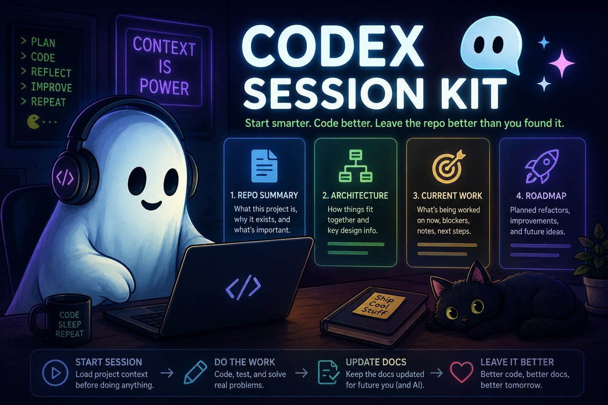

# Getting Started

Codex Session Kit is now handoff-first. The goal is not to auto-write great docs from repo scans. The goal is to help you leave a short, accurate handoff that the next AI session can trust.

## Default Docs

- `docs/project-brief.md`
- `docs/current-work.md`
- `docs/decisions.md`
- `docs/project-memory-snapshot.md`

The first three are human notes. The snapshot is machine-generated repo telemetry.

## First Run

1. Open a real repository folder in VS Code.
2. Open the `Codex` sidebar.
3. Run `Initialize Handoff Docs`.
4. Fill in the human docs with the repo-specific context that code scanning cannot infer.
5. Run `Start Session From Project Memory` before a fresh AI conversation.

## Daily Workflow

1. Start the session with `Start Session From Project Memory`.
2. Do the work.
3. Run `Prepare Handoff Review` to refresh the snapshot and inspect the working checklist.
4. Run `Generate Session Handoff` when you want the cleaner handoff draft.
5. Append or edit `current-work.md` and `decisions.md`.
6. Run `Finish Session And Update Project Memory` at the end.

## Review Vs Handoff

- `Prepare Handoff Review` is the checkpoint command.
  - It refreshes the machine snapshot first.
  - It is meant to help you decide what the handoff should say.
- `Generate Session Handoff` is the cleaner output.
  - It is meant to produce the concise summary you may want to keep, paste, or append.

## What To Write

Good notes include:

- what changed and why
- what future edits should preserve
- what task should happen next
- architectural or workflow decisions that would be painful to rediscover

Less useful notes include:

- timestamps for their own sake
- full transcripts
- every small code change
- shallow repo telemetry that already exists in the snapshot
